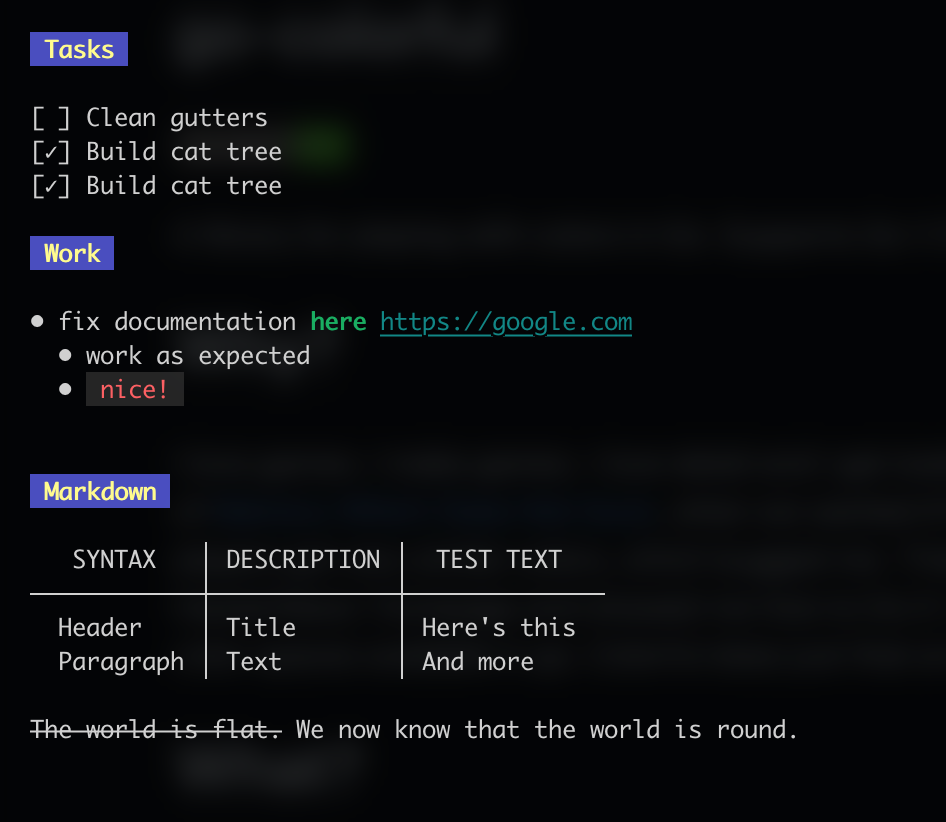
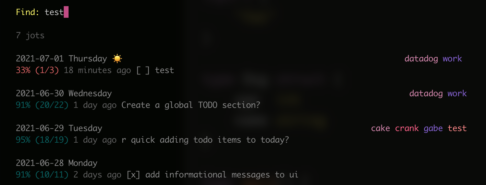
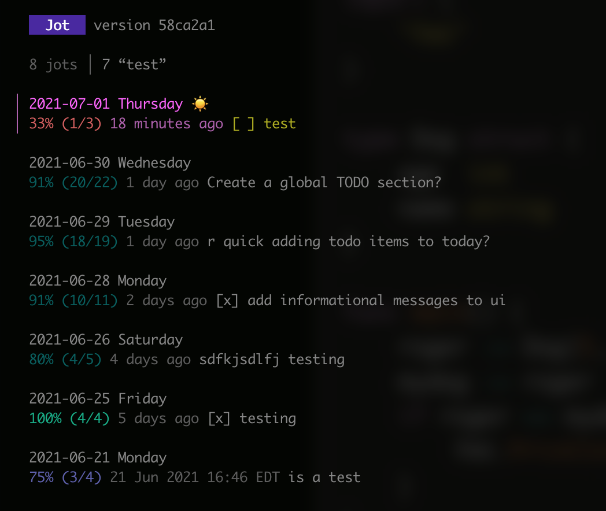
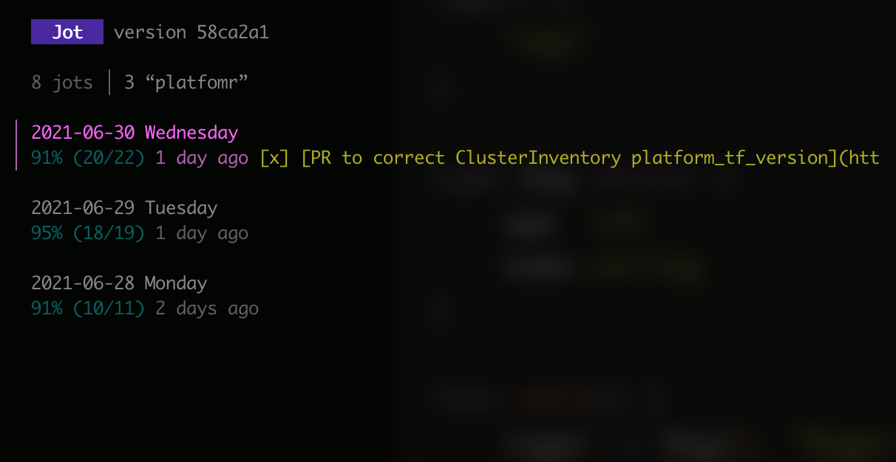
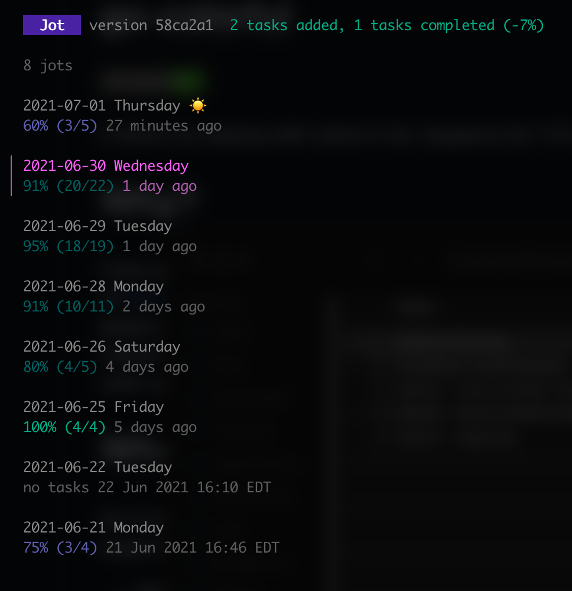
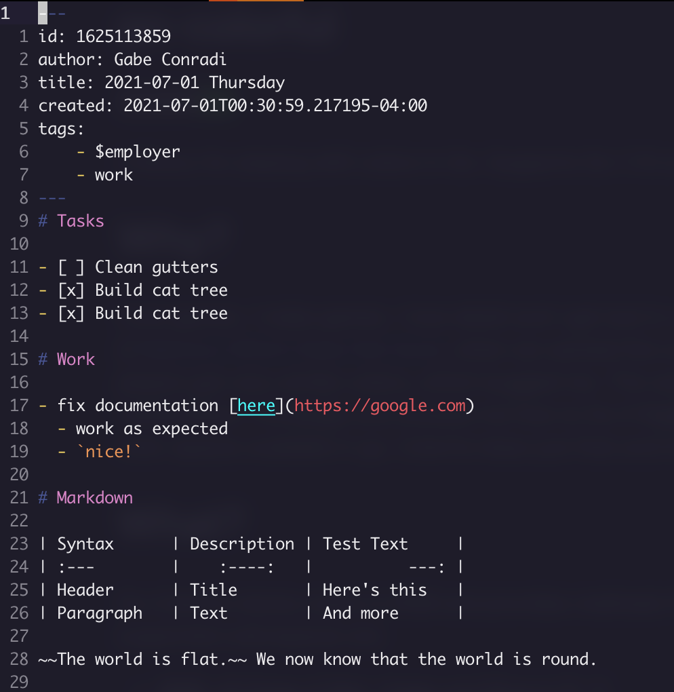

# jot

CLI Task List and Journal

`jot` is a simple journaling program for CLI that helps you keep track of your life.

# Config File

`~/.jot.yaml` is read on startup. The default values are as follows:

```yaml
---
directory: "~/.jot.d"
weekendTags: [ weekend ]
workdayTags: [ work, $employer ]
holidayTags: [ holiday ]
```

# Features

- Organize your day's tasks, notes
- Use familiar `markdown` syntax!
- Keep track of task completion percentage
- Simple format (yaml header+markdown) that is easy to use in other tools
- Simple tagging system helps `jot` work for work and home
- Bring your own file sync, to keep your notes on all your devices (supports dropbox, btsync, owncloud, ...)

## Markdown View



## Search and Organize





## Task Tracking



## Editing




# TODO

- Create new sections for `work`/`weekend`, or perhaps tags?
- CLI subcommands for adding new tasks to an entry
